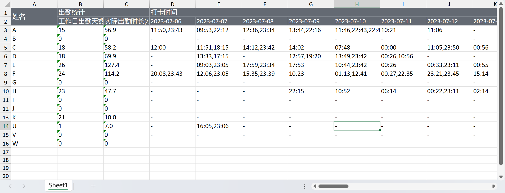
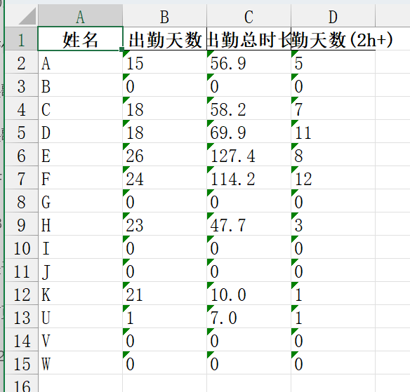

# 考勤统计助手
## 使用说明
1. 进入`dist/main`文件夹
2. 把导出的报表粘贴到`dist/main`下 \
报表格式如下(**请保持一致**) \
文件名需要为`月度汇总****.xlsx`

3. 双击`main.exe`文件
4. 处理后的`output.xlsx`文件即为成果

## 其他说明
`func_check.py`为用于验证功能的临时代码 \
`learning.py`为充满了痕迹的学习过程中的代码 \
`main.py`为最终成形的代码